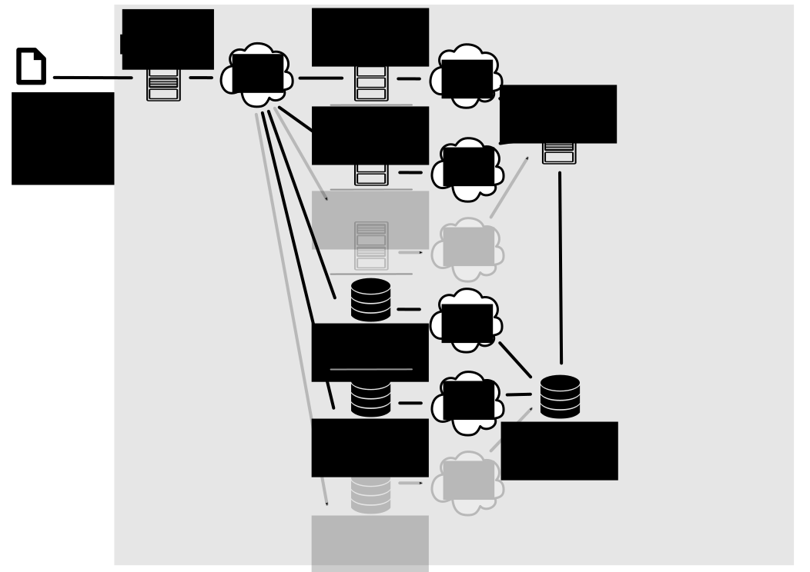

# Spark OWL

## Description

Spark OWL is a library to read OWL files into [Spark](https://spark.apache.org) or [Flink](https://flink.apache.org). It allows files to reside in HDFS as well as in a local file system and distributes them across Spark RDDs/Datasets or Flink DataSets.

## Package Structure

The package contains three modules:

- `sansa-owl-common` which contains platform-independent, mostly parsing specific functionality
- `sansa-owl-spark` which contains Spark-specific code
- `sansa-owl-flink` which contains Flink-specific code

### SANSA OWL Spark

### SANSA OWL Flink

## Usage
