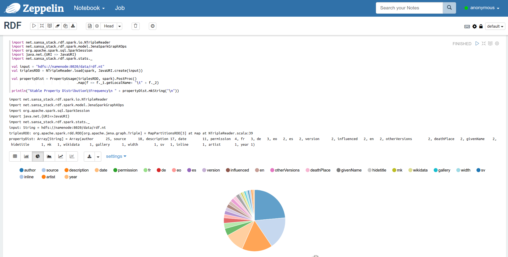

# SANSA-Notebooks
Interactive Spark Notebooks for running [SANSA-Examples](https://github.com/SANSA-Stack/SANSA-Examples).
In this repository you will find a [docker-compose.yml](./docker-compose.yml) for running Hadoop/Spark cluster locally.
The cluster also includes [Hue](http://gethue.com/) for navigation and copying file to HDFS.
The notebooks are created and run using [Apache Zeppelin](https://zeppelin.apache.org/).

# Requirements
* Docker >= 20.10.4
* docker-compose >= 1.28.5
* Around 10 GB of disk space for Docker images

After installation of docker add yourself to docker group (%username% is your username) and relogin:
```
sudo usermod -aG docker %username%
```
This allows to run docker commands without sudo prefix (necessary for running make targets).

# Getting started
Get the SANSA Examples jar file (requires ```wget```):
```
make
```
Start the cluster (this will lead to downloading BDE docker images, will take a while):
```
make up
```
When start-up is done you will be able to access the following interfaces:
* http://localhost:8080/ (Spark Master)
* http://localhost:8088/home (Hue HDFS Filebrowser)
* http://localhost/ (Zeppelin)

To load the data to your cluster simply do:
```
make load-data
```
Go on and open [Zeppelin](http://localhost), choose any available notebook and try to execute it.



To restart Zeppelin without restarting the whole stack:
```
make restart
```
Stop the whole stack:
```
make down
```

## How to Contribute
We always welcome new contributors to the project! Please see [our contribution guide](http://sansa-stack.net/contributing-to-sansa/) for more details on how to get started contributing to SANSA.
